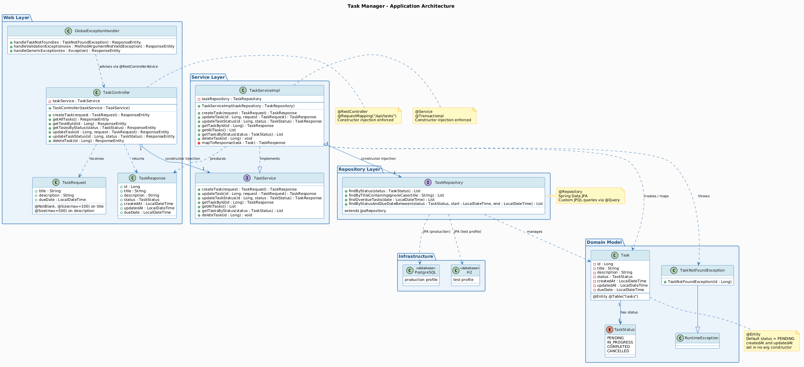

# Task Manager

A RESTful API for task management built with Spring Boot 3.1.5, Java 17, and Spring Data JPA. The project includes a comprehensive, multi-level test suite aligned with the Testing Pyramid, developed using AI-assisted testing practices.

---

## Table of Contents

- [Technology Stack](#technology-stack)
- [Project Structure](#project-structure)
- [Prerequisites](#prerequisites)
- [Running the Application](#running-the-application)
- [API Reference](#api-reference)
- [Data Model](#data-model)
- [Test Suite](#test-suite)
- [Running the Tests](#running-the-tests)
- [Test Coverage](#test-coverage)
- [Configuration](#configuration)

---

## Technology Stack

| Component        | Technology                          |
|-----------------|--------------------------------------|
| Language         | Java 17                             |
| Framework        | Spring Boot 3.1.5                   |
| Persistence      | Spring Data JPA / Hibernate         |
| Database (prod)  | PostgreSQL                          |
| Database (test)  | H2 in-memory                        |
| Build tool       | Maven                               |
| Testing          | JUnit 5, Mockito, AssertJ, MockMvc  |
| Coverage         | JaCoCo                              |

---

## Project Structure

```
taskmanager/
├── pom.xml
└── src/
    ├── main/
    │   ├── java/com/example/taskmanager/
    │   │   ├── TaskManagerApplication.java
    │   │   ├── controller/
    │   │   │   └── TaskController.java
    │   │   ├── dto/
    │   │   │   ├── TaskRequest.java
    │   │   │   └── TaskResponse.java
    │   │   ├── exception/
    │   │   │   ├── GlobalExceptionHandler.java
    │   │   │   └── TaskNotFoundException.java
    │   │   ├── model/
    │   │   │   ├── Task.java
    │   │   │   └── TaskStatus.java
    │   │   ├── repository/
    │   │   │   └── TaskRepository.java
    │   │   └── service/
    │   │       ├── TaskService.java
    │   │       └── TaskServiceImpl.java
    │   └── resources/
    │       ├── application.properties
    │       └── application-test.yml
    └── test/
        └── java/com/example/taskmanager/
            ├── TaskmanagerApplicationTests.java
            ├── e2e/
            │   └── TaskEndToEndTest.java
            ├── integration/
            │   └── TaskIntegrationTest.java
            └── unit/
                ├── controller/
                │   ├── TaskControllerTest.java
                │   └── TaskControllerEdgeCaseTest.java
                ├── repository/
                │   ├── TaskRepositoryTest.java
                │   └── TaskRepositoryEdgeCaseTest.java
                └── service/
                    ├── TaskServiceTest.java
                    └── TaskServiceEdgeCaseTest.java
```

---

## Prerequisites

- Java 17 or higher
- Maven 3.8 or higher
- PostgreSQL 14 or higher (for production profile only; tests use H2)

---

## Running the Application

### With H2 (default, no database required)

The default profile uses an H2 in-memory database and requires no external services.

```bash
mvn spring-boot:run
```

### With PostgreSQL

Create the database and update `application.properties` with your connection details, then run:

```bash
spring.datasource.url=jdbc:postgresql://localhost:5432/taskmanager
spring.datasource.username=your_user
spring.datasource.password=your_password
spring.datasource.driver-class-name=org.postgresql.Driver
spring.jpa.properties.hibernate.dialect=org.hibernate.dialect.PostgreSQLDialect
spring.jpa.hibernate.ddl-auto=update
```

```bash
mvn spring-boot:run
```

The application starts on `http://localhost:8080`.

---

## API Reference

Base path: `/api/tasks`

### Create a task

```
POST /api/tasks
Content-Type: application/json

{
  "title": "Prepare sprint review",
  "description": "Slides and demo",
  "dueDate": "2026-04-15T10:00:00"
}
```

Response: `201 Created`

```json
{
  "id": 1,
  "title": "Prepare sprint review",
  "description": "Slides and demo",
  "status": "PENDING",
  "createdAt": "2026-03-30T12:00:00",
  "updatedAt": "2026-03-30T12:00:00",
  "dueDate": "2026-04-15T10:00:00"
}
```

### Get all tasks

```
GET /api/tasks
```

Response: `200 OK` — array of task objects.

### Get task by ID

```
GET /api/tasks/{id}
```

Response: `200 OK` or `404 Not Found`.

### Get tasks by status

```
GET /api/tasks/status/{status}
```

Valid status values: `PENDING`, `IN_PROGRESS`, `COMPLETED`, `CANCELLED`.

Response: `200 OK` — filtered array of task objects.

### Update a task

```
PUT /api/tasks/{id}
Content-Type: application/json

{
  "title": "Updated title",
  "description": "Updated description",
  "dueDate": "2026-05-01T09:00:00"
}
```

Response: `200 OK` or `404 Not Found`.

### Update task status

```
PATCH /api/tasks/{id}/status?status=IN_PROGRESS
```

Response: `200 OK` or `404 Not Found`.

### Delete a task

```
DELETE /api/tasks/{id}
```

Response: `204 No Content` or `404 Not Found`.

---

## Data Model

### Task entity

| Field       | Type          | Constraints                        |
|-------------|---------------|-------------------------------------|
| id          | Long          | Auto-generated primary key          |
| title       | String        | Required, 1-100 characters          |
| description | String        | Optional, max 500 characters        |
| status      | TaskStatus    | Defaults to PENDING on creation     |
| createdAt   | LocalDateTime | Set on creation                     |
| updatedAt   | LocalDateTime | Updated on each save                |
| dueDate     | LocalDateTime | Optional                            |

### TaskStatus enum

| Value       | Description                      |
|-------------|-----------------------------------|
| PENDING     | Task created, not yet started     |
| IN_PROGRESS | Task is actively being worked on  |
| COMPLETED   | Task has been finished            |
| CANCELLED   | Task was abandoned                |

### Validation rules

- `title` must not be blank (`@NotBlank`)
- `title` must be between 1 and 100 characters (`@Size`)
- `description` must not exceed 500 characters (`@Size`)

Validation failures return `400 Bad Request` with a field-level error map:

```json
{
  "title": "Title is required"
}
```

### Error response format

```json
{
  "status": 404,
  "message": "Task not found with id: 99",
  "timestamp": "2026-03-30T12:00:00"
}
```

---

## Test Suite

The test suite contains 51 tests across 9 classes, organised by Testing Pyramid level.

| Level             | Spring Mechanism         | Test Classes                                          | Tests |
|------------------|--------------------------|-------------------------------------------------------|-------|
| E2E / System      | @SpringBootTest + H2     | TaskEndToEndTest                                      | 4     |
| Integration       | @SpringBootTest + H2     | TaskIntegrationTest                                   | 4     |
| Controller Slice  | @WebMvcTest              | TaskControllerTest, TaskControllerEdgeCaseTest        | 15    |
| Repository Slice  | @DataJpaTest             | TaskRepositoryTest, TaskRepositoryEdgeCaseTest        | 11    |
| Service Unit      | Mockito only             | TaskServiceTest, TaskServiceEdgeCaseTest              | 17    |

### Dependency injection and mocking strategy

All production classes use constructor injection exclusively. This allows unit tests to satisfy dependencies via Mockito's `@InjectMocks` without loading any Spring context.

- `TaskControllerTest` / `TaskControllerEdgeCaseTest`: `TaskService` is replaced by `@MockBean`. Only the web layer is loaded.
- `TaskServiceTest` / `TaskServiceEdgeCaseTest`: `TaskRepository` is replaced by `@Mock`. No Spring context is involved.
- `TaskRepositoryTest` / `TaskRepositoryEdgeCaseTest`: no mocks; real JPA slice with H2.
- `TaskIntegrationTest` / `TaskEndToEndTest`: no mocks; full application context with H2.

---

## Running the Tests

### Run all tests

```bash
mvn test
```

### Run a specific test class

```bash
mvn test -Dtest=TaskServiceTest
```

### Run only unit tests

```bash
mvn test -Dtest="com.example.taskmanager.unit.**"
```

### Run only integration tests

```bash
mvn test -Dtest=TaskIntegrationTest
```

### Run only E2E tests

```bash
mvn test -Dtest=TaskEndToEndTest
```

---

## Test Coverage

JaCoCo is configured to generate an HTML coverage report on every test run.

```bash
mvn test
```

After the build completes, open the report in a browser:

```
target/site/jacoco/index.html
```

The report shows line, branch, and method coverage per class. No minimum threshold is enforced; coverage is treated as evidence rather than a gate.

---

## Configuration

### application.properties (default profile)

```properties
spring.application.name=taskmanager
spring.datasource.url=jdbc:h2:mem:devdb;MODE=PostgreSQL;DB_CLOSE_DELAY=-1
spring.datasource.username=sa
spring.datasource.password=
spring.datasource.driver-class-name=org.h2.Driver
spring.jpa.hibernate.ddl-auto=create-drop
spring.jpa.properties.hibernate.dialect=org.hibernate.dialect.H2Dialect
spring.jpa.show-sql=false
```

### application-test.yml (test profile)

```yaml
spring:
  datasource:
    url: jdbc:h2:mem:testdb;MODE=PostgreSQL;DB_CLOSE_DELAY=-1
    username: sa
    password:
    driver-class-name: org.h2.Driver
  jpa:
    hibernate:
      ddl-auto: create-drop
    properties:
      hibernate:
        dialect: org.hibernate.dialect.H2Dialect
    show-sql: true
```

The test profile is activated automatically for all test classes annotated with `@ActiveProfiles("test")` or for `@DataJpaTest` slices, which manage their own datasource configuration independently.